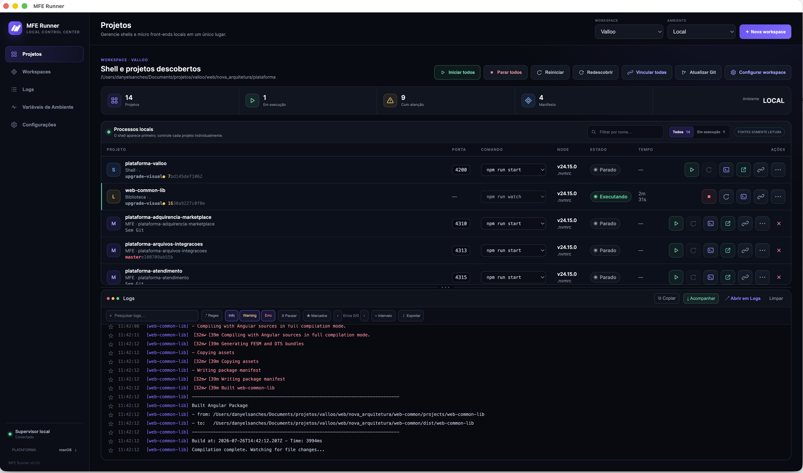

# MFE Runner

MFE Runner is a cross-platform desktop control center for local development.
It discovers, starts, stops, supervises, and diagnoses related applications
from a single interface, without modifying their source files.

Despite its name, MFE Runner is not limited to micro frontends or JavaScript.
It can manage a standalone SPA, a monolith, a backend or frontend application,
a shared library, or a mixed-language workspace. Node.js support is stable;
Java/Maven, Java/Gradle, .NET, Python, Rust, Go, and Flutter are available as Beta
integrations while their cross-platform coverage continues to grow.

[Website](https://mferunner.com/) ·
[Downloads](https://github.com/danielverissimo/mfe-runner/releases) ·
[Report an issue](https://github.com/danielverissimo/mfe-runner/issues)



## Official website

Visit [mferunner.com](https://mferunner.com/) to learn more about MFE Runner,
review its main features, and download the recommended installer for your
operating system. Other supported platforms and architectures remain available
through the download selector.

## Highlights

- Unified workspaces containing any number of exact projects, project roots,
  monorepos, and optional locally linked libraries.
- Automatic source inspection with reviewable Project/Library classification,
  stable project identities, and a visual order saved per workspace.
- Individual and batch start, stop, restart, and health monitoring.
- Persistent lightweight supervisor that can keep processes and logs alive
  after the Electron interface closes.
- Persistent external-service links for local TCP listeners, published Docker
  ports, and manually configured HTTP/HTTPS upstreams.
- Consolidated logs with project filters, text or regular-expression search,
  severity filters, bookmarks, pause/follow modes, error navigation, and
  sanitized diagnostic exports.
- Runtime and tool policies at global, workspace, and project level, with
  automatic or explicit local installation selection.
- Read-only Git context with branch, commit, dirty state, and local
  ahead/behind information.
- Safe shortcuts for opening a project in an IDE, terminal, file manager, or
  browser.
- Local library watch and link workflows through existing `link:*` scripts.
- Brazilian Portuguese, English, Spanish, and French interfaces.
- Automatic updates distributed through the official GitHub Releases.

## Supported platforms

Installers are published for:

- macOS on Apple Silicon (`arm64`) and Intel (`x64`);
- Windows 11 on ARM (`arm64`) and legacy 32-bit Windows (`ia32`);
- Debian/Ubuntu Linux with DEB packages on ARM (`arm64`) and Intel/AMD (`x64`);
- Fedora/RHEL Linux with RPM packages on ARM (`arm64`) and Intel/AMD (`x64`).

Download the recommended installer for your platform from
[mferunner.com](https://mferunner.com/) or directly from
[GitHub Releases](https://github.com/danielverissimo/mfe-runner/releases).

> The Windows `ia32` build is a legacy compatibility edition. Electron 43 is
> the last Electron series that provides Windows `ia32` binaries.

## Ecosystem support

| Ecosystem | Level | Detection and commands |
| --- | --- | --- |
| Node.js | Stable | `package.json`, `.nvmrc`, npm scripts, NVM, local-library `link:*` |
| Java / Maven | Beta | `pom.xml`, modules, Maven Wrapper, Spring Boot, Quarkus, test/package |
| Java / Gradle | Beta | Groovy/Kotlin DSL, multiproject builds, Gradle Wrapper, run/bootRun/Quarkus |
| .NET | Beta | `.sln`, `.csproj`, `global.json`, run/test/build |
| Python | Beta | `pyproject.toml`, requirements, Pipfile, Poetry, uv, common web frameworks |
| Rust | Beta | Cargo projects/workspaces, rust-toolchain, run/test/build |
| Go | Beta | `go.mod`, `go.work`, run/test/build with toolchain downloads disabled |
| Flutter | Beta | `pubspec.yaml`, Flutter/FVM, Web/Android/iOS run/test/build and device selection |

Beta integrations are intentionally conservative: discovery is static, missing
or incompatible runtimes are reported instead of installed, and ambiguous
entry points require a reviewed command. Contributions with fixtures,
cross-platform tests, detector refinements, and runtime-resolution fixes are
especially welcome.

## How it works

1. Create a workspace and add one or more paths. Each path may point to an
   exact project, a root containing multiple projects, or a monorepo.
2. MFE Runner scans only the configured roots. It ignores generated,
   dependency, and VCS directories such as `node_modules`, `dist`, `.angular`,
   and `.git`.
3. Review every detected package and confirm whether it is a Project or a
   Library. Detection evidence and optional Host/MFE capabilities remain
   informative and can be overridden without changing project files.
4. Arrange the catalog in the order that best matches your workflow. The visual
   order is stored per workspace and remains independent from process startup
   order.
5. All confirmed projects appear in one technology-independent catalog.
   Ecosystem adapters read only bounded build metadata and never execute a
   build, plugin, task, or project script during discovery.
6. Commands come from an allowlisted structured profile created by the
   authoritative adapter. The renderer sends only workspace, project, and
   command IDs.
7. Runtime state, logs, health information, and private overrides remain in
   MFE Runner's own user-data directory.

The private configuration format is version 6. It stores unified
`projectSources[]`, generic `executionPolicies`, command IDs, health checks,
and per-project overrides, plus optional `externalServices[]` definitions.
Previous configurations are backed up and migrated
automatically, preserving workspaces, stable project IDs, classifications,
exclusions, visual order, and Node local-library link settings. Supervisor
protocol v9 gracefully stops processes owned by an obsolete protocol before
replacing its detached daemon; project files are unaffected.

Rediscovery is review-first: new, unchanged, and missing projects are shown
before the catalog is changed. Canceling the review leaves the active catalog
and running processes untouched.

## Local libraries

A discovered package may be classified as a Library. Angular library metadata
such as `projectType: library` and `ng-package` provides a reliable automatic
suggestion, while other packages can be classified manually.

MFE Runner can:

- run a library normally without configuring local linking;
- optionally enable local linking, selecting `watch` as the development
  script and falling back to `build`;
- infer the artifact directory from `ng-package.json`;
- start the library watcher before linking when the artifact does not exist;
- link one consumer, all consumers, or all configured libraries;
- run only an existing consumer script whose name starts with `link:`;
- restore consumers that were running before a link operation.

Libraries are never treated as consumers. Removing a library
from MFE Runner removes only its private configuration; it does not delete
files or undo links previously created by project-owned scripts.

## Safe removal

Removing a project hides it from the workspace configuration without deleting
its directory. Removing a complete workspace first stops its managed processes
and then deletes only the private MFE Runner configuration. Source files,
repositories, dependencies, and project-owned links are never removed.

## Runtime and tool resolution

Every ecosystem uses the same precedence:

```text
project → workspace → global settings
```

Policies select `auto`, `explicit`, or inheritance where applicable. Runtime
and build/package tools are resolved separately. An explicitly selected
installation is never silently replaced. An unavailable or incompatible
runtime blocks execution; warnings remain visible and can be reviewed.

MFE Runner never installs runtimes, SDKs, wrappers, package managers, or
toolchains.

### Node.js

Each project, workspace, and global setting supports inherited, automatic, or
explicit Node.js selection:

```text
project → workspace → global settings
```

Automatic mode searches for the nearest applicable `.nvmrc`. Explicit mode
can list locally installed versions from `nvm-sh` or NVM for Windows, while
still allowing manual version input. MFE Runner resolves the `node` and `npm`
executables directly and never constructs a free-form `nvm use` shell command.

A missing requested version blocks the process with a diagnostic message.
MFE Runner never installs Node.js automatically.

### Java

JDK resolution considers Gradle toolchains, Maven release/source/target,
SDKMAN and `.java-version` hints, `JAVA_HOME`, known JDK directories, and
`PATH`. Maven and Gradle prefer project wrappers, but an explicit global,
workspace, or project policy can select an installed tool instead. No
dependency resolution or build task runs during scanning.

### Flutter

Flutter projects are detected from `pubspec.yaml`. The Runner supports Web,
Android, and iOS run/build commands plus Flutter tests. Runtime resolution
prefers a project-local FVM SDK (`.fvm/flutter_sdk` or FVM metadata), then
Flutter configured in the environment or available on `PATH`. The project list
shows only Run, Test, and Build. Starting one of these actions opens a target
dialog: Web runs without device selection, while Android and iOS require an
available device or emulator. Devices are queried explicitly through Flutter's
machine-readable device listing. If Android has no running device, the dialog
can list configured AVDs with the Android SDK Emulator and start the selected
one. The Runner waits for Flutter to detect the new emulator before continuing
the original action. An emulator started this way remains independent when the
project or Runner stops. The Runner never installs Flutter, FVM, SDKs,
emulators, AVDs, or devices.

For Flutter Web runs, the supervisor reserves a free loopback port and passes
it to Flutter through the structured `--web-hostname` and `--web-port` options.
The HTTP port is shown in the project table and can be opened, copied, or linked
to ngrok while the process is active.

### ngrok tunnels

An active managed process with a known HTTP port can be linked to a reserved
ngrok domain directly from the project table. Configure the official ngrok
agent first with both credentials required by ngrok: the agent `authtoken` for
starting endpoints and the API key for account operations. MFE Runner never
reads or stores either credential; it invokes the installed CLI with its
validated configuration file.

The settings page detects ngrok, validates its configuration, allows an
explicit executable path, and links to the official installation and
credential pages. Domain listing and creation happen only after an explicit
user action. Creating a custom domain requires a native confirmation because
it may require a paid plan or incur charges. Wildcard domains are shown but
cannot be linked in this release.

The credential setup commands can be copied individually with placeholder
values; the Runner never asks for or copies real credentials. The configuration
file detected by `ngrok config check` can also be opened in the IDE selected in
Settings. The renderer sends only the open intent—the main process resolves and
validates the file again before launching the configured editor.

When creating a managed ngrok domain, the user enters only the short name and
chooses one of the ngrok suffixes offered by the Runner. The renderer never
sends an arbitrary full hostname: the main process validates the name and
reconstructs the hostname from an allowlisted suffix. Domains already owned by
the account can be selected immediately. The public Reserved Domains API does
not expose the portal's preventive availability lookup, so final availability
is confirmed by ngrok during the explicit create operation; an unavailable
option is marked in the dialog without exposing raw CLI diagnostics.

The tunnel is a supervised sidecar. It stops with the project and is restored
after the direct **Restart** action. A manual stop followed by a later start
does not restore it, preventing accidental public exposure. See the official
[ngrok CLI](https://ngrok.com/docs/agent/cli),
[agent configuration](https://ngrok.com/docs/agent/config/v3), and
[free-plan limits](https://ngrok.com/docs/pricing-limits/free-plan-limits).

### External services

Use **Link external service** above the process table to monitor an HTTP or
HTTPS service started outside MFE Runner. The dialog can explicitly discover
local TCP listeners and running Docker containers with published ports, or
accept a manual host and port. Ports already owned by a discovered project,
managed process, or linked external service are excluded from the import
catalog.

Docker logs are followed with the installed Docker CLI. A generic process can
optionally follow an application log file, including append, truncation, and
rotation. Output already captured by IntelliJ or another terminal cannot be
recovered retroactively; configure that application to write to a file when
logs are required. Remote services can be monitored but cannot be terminated.

External definitions reconnect after the Runner reopens. If an upstream goes
offline its log collector and ngrok tunnel stop. Monitoring resumes only when
the same local process or container identity returns; ngrok is not reopened
automatically. If another process reuses the port, the row reports an identity
mismatch and requires confirmation before rebinding.

Unlinking removes only Runner state. Stopping an external process or container
is a separate, confirmed action, and global start/stop/restart or exit policies
never terminate external targets. Docker discovery/logging/stopping uses the
official CLI with fixed argument arrays and `shell: false`; MFE Runner does not
install Docker or change container configuration. See
[Docker logs](https://docs.docker.com/reference/cli/docker/container/logs/).

## Safety principles

- The Electron renderer is sandboxed with context isolation and no Node.js
  integration.
- The preload exposes a small allowlisted API and the main process validates
  senders and payloads.
- Commands are launched from structured `LaunchSpecification` values with
  argument arrays and `shell: false`.
- Executables and arguments are reconstructed by the authoritative ecosystem
  adapter; the renderer cannot provide either.
- XML and TOML metadata are bounded before parsing; XML entity expansion is
  disabled.
- Discovery performs no network access and executes no builds, Gradle tasks,
  Maven plugins, wrappers, or project scripts.
- Native project actions resolve their paths again in the main process.
- Git inspection is read-only and uses local references.
- Known sensitive fields are redacted from displayed and exported logs.
- Diagnostic exports remove absolute paths by default.
- Project manifests, `.nvmrc`, `.env`, `package.json`, and source files remain
  unchanged.

The only intentional project-side mutation is whatever an explicitly requested
project-owned `link:*` script performs, normally inside `node_modules`.

## Development setup

### Requirements

- Node.js `>=22.12.0` (`24.15.0` recommended);
- npm `>=10` (npm 11 recommended);
- Chrome or Chromium available for Angular headless tests;
- NVM is optional, but recommended for testing Node.js version resolution.
- Install only the runtimes/tools needed for the ecosystem adapters you intend
  to exercise. The Runner will not install them for you.

Install dependencies and start the packaged development build:

```bash
npm ci
npm start
```

For Angular renderer development with reload:

```bash
npm run dev
```

### Project structure

```text
src/                    Angular renderer
electron/               Electron main, preload, supervisor, and native adapters
electron/assets/        Application icons and packaging assets
scripts/                Development, packaging, and release automation
docker-server/          Landing page and deployment configuration
vm-smoke-fixture/       Cross-platform smoke-test fixture
```

More detailed documentation:

- [User guide](docs/USER_GUIDE.md)
- [Architecture and security boundaries](docs/ARCHITECTURE.md)
- [Multi-ecosystem implementation plan](docs/MULTI_ECOSYSTEM_SUPPORT_PLAN.md)
- [Security policy](SECURITY.md)
- [Landing-page and release operations](docker-server/README.md)

### Validation

Run the full local validation before submitting a change:

```bash
npm test
npm run lint
npm run build
```

Focused commands are also available:

```bash
npm run test:electron
npm run test:angular
```

## Contributing

Contributions are welcome. Beta adapter fixtures and tests on macOS, Windows,
and Linux are a current priority, alongside detector improvements, runtime
compatibility fixes, documentation, translations, accessibility, and focused
UX improvements.

### Contribution workflow

1. Fork [`danielverissimo/mfe-runner`](https://github.com/danielverissimo/mfe-runner)
   and clone your fork.
2. Create a branch from the current default branch:

   ```bash
   git checkout -b fix/short-description
   ```

3. Install the locked dependencies:

   ```bash
   npm ci
   ```

4. Make a focused change and avoid unrelated formatting or generated output.
5. Add or update tests for behavior changes.
6. Add translations for every new user-facing message in all supported
   languages.
7. Run the validation commands:

   ```bash
   npm test
   npm run lint
   npm run build
   ```

8. Push your branch and open a pull request. Explain the problem, the chosen
   solution, the validation performed, and any platform-specific limitations.
   Include screenshots or a short recording for visual changes.

### Contribution guidelines

- Never commit secrets, signing certificates, private keys, tokens, local
  configuration, installers, or generated `dist/` and `release/` output.
- Preserve the read-only boundary of managed projects.
- Do not add free-form shell execution or accept executable paths directly
  from the renderer.
- Keep macOS, Windows, and Linux behavior in mind when changing native
  adapters, paths, process trees, sockets, installers, or update flows.
- Discuss new production dependencies and broad architectural changes in an
  issue before implementing them.
- Publishing, signing, notarization, and server deployment are maintainer-only
  operations and should not be run from a contribution branch.

If a contribution cannot be validated on every platform, state exactly which
platforms were tested in the pull request.

## Packaging

Official application artifacts are built on the macOS host. Windows and Linux
virtual machines are used to run and test the generated artifacts.

Generate all recommended installers:

```bash
npm run dist:installers
```

Generate one platform and architecture:

```bash
npm run dist:mac:arm64:installer
npm run dist:mac:x64:installer
npm run dist:win:arm64:installer
npm run dist:win:ia32:installer
npm run dist:linux:arm64:installer
npm run dist:linux:x64:installer
npm run dist:linux:arm64:rpm
npm run dist:linux:x64:rpm
```

Every `dist:*` command clears generated `dist/` and `release/` output before
building. Run `npm run clean:artifacts` to perform only that cleanup.
The complete installer workflow also verifies the mandatory dependency closure
inside every unpacked application before a release can be published. Run
`npm run verify:packaged-dependencies` to repeat this check for existing build
output.

The macOS artifacts require the `mfe-runner-notary` Keychain profile and fail
instead of silently distributing an unnotarized application. Windows
installers remain unsigned until an Authenticode certificate is configured, so
Windows SmartScreen may display a warning. RPM packaging requires `rpmbuild`;
install it on the official macOS build host with `brew install rpm` before
running the complete release workflow.

## Releases and automatic updates

Official binaries and updater metadata are hosted in
[GitHub Releases](https://github.com/danielverissimo/mfe-runner/releases).
The `mferunner.com` server hosts the landing page and reads the public GitHub
release catalog; it does not mirror application binaries.

MFE Runner checks for updates shortly after startup and also exposes
**Help → Check for updates…**. It never downloads or installs an update without
user confirmation.

Maintainers can publish a complete patch release with:

```bash
npm run dist:installers:publish
```

This workflow requires an authenticated GitHub CLI, a clean and synchronized
Git branch, and the required Apple signing and notarization credentials. It
updates the patch version, records and pushes the version files, builds all
installers, uploads a draft release, and publishes it after the complete
artifact set is available.

To publish already-built artifacts for the current version:

```bash
npm run publish:update
```

Existing releases are not overwritten. A correction must use a new version.
See [`docker-server/README.md`](docker-server/README.md) for landing-page
deployment details.
